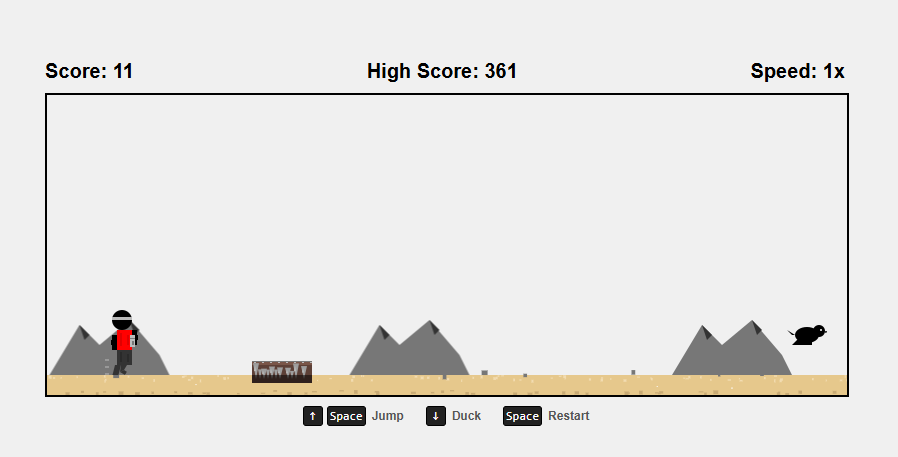

# Human Runner Offline

A fast-paced endless runner game where you control a human character running through a desert landscape while avoiding obstacles and being chased by a dog.



## Description

Human Runner Offline is an exciting browser-based endless runner game inspired by the Chrome dinosaur game. The player controls a human character who must jump or duck to avoid various obstacles like cacti, birds, spike pits, and mines. As the game progresses, a dog will start chasing the player, making the game even more challenging.

## Features

- Simple, addictive gameplay
- Progressive difficulty with increasing speed
- Multiple obstacle types:
  - Cacti of different sizes
  - Flying birds (including special gray birds that can reverse direction)
  - Spike pits
  - Ground spikes
  - Mines with explosion effects
  - Native characters that throw spears
- Dynamic dog chase mechanic after reaching 500 points
- Weather effects including rain and lightning
- Special jump mechanics including star jump at peak height
- Rare earthquake events
- Speed boost/reduction powerups
- Progressive speed increases as score rises
- Local high score tracking

## Installation

No installation required:
1. Clone this repository or download the ZIP file
2. Extract the files to your preferred location
3. Open `index.html` in any modern web browser

Or simply:
```
git clone https://github.com/yourusername/human-runner-offline.git
cd human-runner-offline
```
Then open `index.html` in your browser.

## How to Play

1. Open `index.html` in a web browser to start the game
2. Use the following controls:
   - **Space / Up Arrow**: Jump over obstacles
   - **Down Arrow**: Duck under flying obstacles
   - **Space**: Restart the game when game over

## Game Strategy

- Time your jumps carefully to avoid obstacles
- Be prepared for the dog that appears after 500 points
- Watch out for gray birds that can reverse direction
- Duck when birds fly low
- Jump over cacti and spike pits
- Avoid mines that explode on contact
- Take care during rain as lightning may strike if you jump
- The game speed increases gradually, making obstacles appear faster

## Detailed Game Mechanics

### Obstacles
- **Cacti**: Come in three sizes (small, medium, and large) with different hitboxes
- **Birds**: Fly at different heights, requiring the player to jump or duck accordingly
- **Gray Birds**: Special type that can reverse direction unexpectedly
- **Spike Pits**: Require carefully timed jumps to clear completely
- **Ground Spikes**: Smaller obstacles that appear suddenly
- **Mines**: Explode on contact with animation effects
- **Natives**: Throw spears at the player that must be avoided

### Dog Chase
After reaching 500 points, a dog will begin to chase the player:
- The dog runs at variable speeds, sometimes matching the player's speed
- It has attack and jump animations
- Getting caught by the dog ends the game

### Weather Effects
- **Rain**: Periodically affects gameplay, making the ground slippery
- **Lightning**: Can strike if the player jumps during rainy conditions
- **Earthquakes**: Rare events that shake the screen and affect movement

### Special Jumps
- **Star Jump**: Activated at the peak of certain jumps, providing special effects
- Jumping mechanics include variable height based on how long the jump button is pressed

## Technical Implementation

The game is built using vanilla JavaScript, HTML5 Canvas for rendering, and CSS for styling. All game assets are procedurally generated using Canvas drawing operations or stored as sprite images.

### Project Structure
- `game.js`: Main game loop and state management
- `player.js`: Player character logic and animation
- `obstacles.js`: Obstacle generation and collision detection
- `renderer.js`: Canvas rendering engine
- `score.js`: Score tracking and display
- Several specialized classes for each obstacle type (bird.js, cactus.js, etc.)

## Browser Compatibility

The game works best in modern browsers that support HTML5 Canvas:
- Chrome
- Firefox
- Safari
- Edge

## Development

If you want to modify or extend the game:
1. All game parameters can be adjusted in `constants.js`
2. Add new obstacles by creating a new class that extends the base obstacle class
3. Sprite generation utilities are available in the `backup` folder
4. The game uses a time-based animation system to ensure consistent speed across different devices

## Troubleshooting

- If you encounter performance issues, try reducing the game's quality by modifying constants in `constants.js`
- For best experience, play in fullscreen mode
- Make sure your browser supports HTML5 Canvas

## Credits

Developed by Minh Pham in 2025.

## License

This project is licensed under the MIT License - see the LICENSE file for details.

## Acknowledgments

- Inspired by the Chrome dinosaur offline game
- Special thanks to all testers and contributors